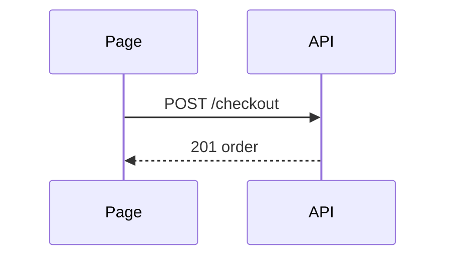

# Body

A reviewer should see the change in a glance. One sentence, then a shape. The attached proof sits under them.

GitHub renders fenced `text`, `diff`, and `mermaid` in a pull request. It will not render an HTML file. A UI mockup is a screenshot from capture.

## Pick one shape

Match the change. A second shape only if it shows something the first cannot.

| Change | Shape |
|--------|--------|
| logic or an algorithm | indented pseudocode |
| runtime control flow | call tree |
| UI structure | component tree, with the files and state that matter |
| layout or a refactor | shallow file tree, one line of responsibility each |
| a small edit to a shape that already exists | a `diff` of that same shape |
| interaction or data flow | a mermaid sequence or state diagram |

Keep only the calls, files, props, states, and boundaries the reviewer needs. Leave the rest out.

## Pseudocode

```text
on(save)
  if draft is empty
    return
  write draft
  show saved
```

## Call tree

```text
submitCheckout
  priceCart
  chargeCard
  placeOrder
```

## Component tree

```text
<CheckoutPage> (app/checkout/page.tsx)
  useCart()
  <PayButton> (packages/ui)
```

## File tree

```text
src/
├── cart/     # line items and totals
└── pay/      # charge and receipt
```

## Diff of a shape

When the surrounding shape already exists, show what moved.

A component:

```diff
 <CheckoutPage>
   useCart()
+  <PayButton />
   <OrderSummary>
```

A call tree:

```diff
 submitCheckout
   priceCart
+  applyGiftCard
   chargeCard
   placeOrder
```

A file tree:

```diff
 src/
 ├── cart/
-└── charge.ts
+└── pay/
+    ├── charge.ts
+    └── receipt.ts
```

Pseudocode:

```diff
 on(save)
-  write draft
+  if draft is empty
+    return
+  write draft
```

Show the whole block when most of it is new, or when omitted lines would hide ownership or order.

## Mermaid

Use it when a sequence or state chart is smaller than the tree. GitHub draws it.



## Prose

The sentence above the shape is how a person talks.

- Lead with the point.
- No em dashes or en dashes.
- No "not X but Y", no "isn't A, it's B".
- No lists of three for rhythm, no throat clearing, no landing line.
- Contractions are fine.

If the repo has a pull request template (`PULL_REQUEST_TEMPLATE.md`, `.github/PULL_REQUEST_TEMPLATE.md`, `.github/PULL_REQUEST_TEMPLATE/*`, `docs/PULL_REQUEST_TEMPLATE.md`), start from that file and fill it. Keep the shape and the evidence.
